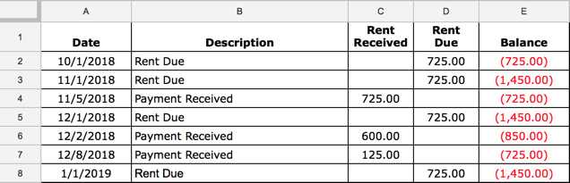

# rent-tracker

Rent-Tracker is a service that records and tracks the rent that I receive from my rental property each month. I rent one of my homes to a family member (never do it!), so he feels that he can pay me when/how he wants. Often times, I will get my rent at a family gathering, via Paypal, or in an envelope under my doormat. Tracking the amount he pays each month is challenging, so I needed a solution that makes it easy to record the payment.

## Script Overview

The service uses Twilio for SMS integration and Google Sheets to record a payment and check the account balance.

## Example Usage

If I text my Twilio number: **I received a $725 payment**

* The rent-tracker service receives the request from Twilio and updates the google spreadsheet with the date, description and payment amount.

If I text my Twilio number: **Check balance**

* The service will respond with the following: **As of 1/1/2019, the account has a balance of $1,450.00**

## Built With

* [Pygsheets](https://github.com/nithinmurali/pygsheets) - Google Spreadsheets Python API
* [Twilio](https://www.twilio.com) - Gives you the ability to send/receive SMS messages to your application.